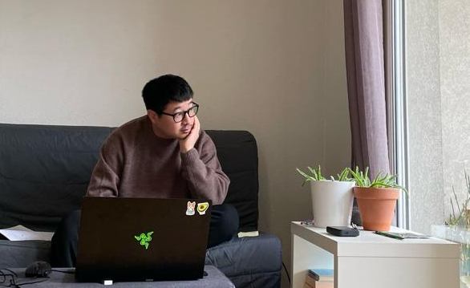

<div align="center">


# Chara Survival

**Thermodynamic Graph Laplacian Survival Inference for Transcriptomic Oncology**

[](https://pypi.org/project/chara-survival/)
[](https://pypi.org/project/chara-survival/)
[](LICENSE)
[](https://huggingface.co/spaces/Sharon-codes/Chara)
[](https://www.iitmandi.ac.in)

*A frozen 4,337-gene thermodynamic intersection signature that transfers across sequencing platforms — zero retraining required.*

</div>

---

## The Problem

Standard survival models — Cox proportional hazards, Random Survival Forests, DeepSurv — are trained on RNA-seq cohorts (typically TCGA) and **collapse catastrophically** when applied to microarray data (GEO). The cause is structural: uncorrected platform variance and feature distribution shift corrupt the learned risk landscape. The concordance index, already noisy at 0.50–0.55 on in-distribution data, degrades to random or sub-random when the platform changes.

This failure is not a modelling artefact. It is a **physical problem** — raw transcript counts do not encode the molecular interaction topology that determines biological function. Chara corrects this at the feature level, before training even begins.

## The Solution

Chara grounds gene expression features in **thermodynamic graph Laplacians** derived from MARTINI 3 coarse-grained molecular dynamics (MD) simulations. Specifically:

1. **MARTINI 3 MD trajectories** are run for key oncogenic protein systems (KRAS, CMYC/MAX, PTPN11, MUT-TP53) across biological replicates.
2. **Exponential heat kernels** are computed from the symmetrised graph Laplacian of the STRING protein–protein interaction network, weighted by MD-derived edge variances via the Chara exponential operator.
3. The resulting **thermodynamic Laplacian representation** produces a platform-invariant feature space — the spectral geometry of molecular interaction rather than raw transcript abundance.
4. A **frozen CoxNet** trained on TCGA-LUAD using these 4,337 thermodynamically-stabilised features is applied directly to unseen cohorts without fine-tuning.

The result is a model that generalises across the RNA-seq ↔ microarray boundary as a matter of physical principle, not statistical luck.

---

## Performance

Evaluated zero-shot on **GSE31210** (Affymetrix Human Genome U133 Plus 2.0, n = 226, completely held-out lung adenocarcinoma microarray cohort — never seen during training):

| Model | OOD C-Index | 1-Year AUC | 3-Year AUC | 5-Year AUC |
|---|---:|---:|---:|---:|
| Clinical Cox-PH (Age, Gender, Stage) | 0.5000 | 0.5000 | 0.5000 | 0.5000 |
| Random Survival Forest (RSF) | 0.4041 | 0.4175 | 0.3657 | 0.4842 |
| Elastic Net Coxnet (Raw 5,200 genes) | 0.5248 | 0.4664 | 0.4081 | 0.2428 |
| DeepSurv (Deep Neural Network) | 0.5537 | 0.5465 | 0.3937 | 0.3122 |
| **Chara (Thermodynamic Laplacian)** | **0.7311** | **0.7463** | **0.7826** | **0.8195** |

Chara achieves a **+0.267 absolute improvement in OOD C-index** over the next-best deep learning baseline, with monotonically improving time-horizon AUC — an unusual and clinically meaningful signature of robust calibration rather than threshold overfitting.

---

## Live Inference

A zero-install interactive inference interface is hosted on Hugging Face Spaces:

**→ [https://huggingface.co/spaces/Sharon-codes/Chara](https://huggingface.co/spaces/Sharon-codes/Chara)**

Upload a patient-by-gene CSV (rows = samples, columns = HGNC symbols). The app aligns your cohort to the frozen 4,337-gene signature, computes risk scores, renders Kaplan–Meier–style survival curves, and returns a downloadable report — all in seconds.

---

## Python Package

### Installation

```bash
pip install chara-survival
```

Requires Python ≥ 3.10. The frozen model artefact (`chara_model_4337.pkl`) must be placed in your working directory or downloaded from the [Releases](https://github.com/Sharon-codes/Chara/releases) page.

### Programmatic Inference

```python
import pandas as pd
from chara import CharaModel

# Load the frozen model
model = CharaModel.load("chara_model_4337.pkl")

# expression_matrix: patients × HGNC gene symbols
expression_matrix = pd.read_csv("patient_expression.csv", index_col=0)

# Align, scale, and infer
risk_scores, x_scaled, aligned_df, scaler, alpha_index = model.predict(expression_matrix)

print(f"Processed {len(expression_matrix)} patients")
print(f"Risk score range: [{risk_scores.min():.4f}, {risk_scores.max():.4f}]")
```

### Survival Curve Extraction

```python
import numpy as np

# Retrieve full survival functions for all patients
curves, times = model.survival_curves(x_scaled, alpha_index)

# Interpolate to clinical horizons
horizons = np.array([365.0, 1095.0, 1825.0])  # 1, 3, 5 years
survival = np.array([
    np.interp(horizons, times, row, left=1.0, right=row[-1])
    for row in curves
])
# survival[:, 0]  →  1-year survival probability per patient
# survival[:, 1]  →  3-year survival probability per patient
# survival[:, 2]  →  5-year survival probability per patient
```

### Thermodynamic Graph Utilities

The `chara` package also exposes the graph primitives used during training:

```python
from chara.graph import laplacian_from_edges, heat_kernel, exponential_chara_laplacian

# Construct a graph Laplacian from an edge list (e.g., STRING interactions)
L = laplacian_from_edges(edge_df, node_list, source="protein1", target="protein2", weight="score")

# Standard heat kernel (diffusion on Laplacian spectrum)
K = heat_kernel(L, diffusion_time=0.1)

# Chara exponential operator — weights edges by MD variance
L_chara = exponential_chara_laplacian(adjacency, edge_variance, tau=0.5)
```

### API Reference

#### `CharaModel`

| Method | Signature | Description |
|---|---|---|
| `load` | `cls, path: str \| Path → CharaModel` | Deserialise a frozen Chara model bundle. |
| `predict` | `expression: DataFrame → (risk, x_scaled, aligned, scaler, alpha)` | Align, scale, and score a patient cohort. |
| `align_and_scale` | `expression: DataFrame → (x, aligned, scaler)` | Feature alignment only. |
| `survival_curves` | `x, alpha_index → (curves, times)` | Full survival functions via the frozen CoxNet. |

#### `scale_external_expression`

```python
from chara import scale_external_expression

x, aligned, scaler = scale_external_expression(expression_df, feature_list)
```

Aligns an external expression matrix to a target feature list (zero-imputing missing genes, averaging duplicate symbols) and applies `StandardScaler`.

---

## Input Specification

| Property | Requirement |
|---|---|
| **Format** | CSV, rows = patients/samples, columns = HGNC gene symbols |
| **Values** | Continuous numeric (TPM, FPKM, log2-counts, normalised microarray intensities) |
| **Missing genes** | Zero-imputed against the 4,337-gene signature |
| **Duplicate symbols** | Averaged automatically |
| **Platforms tested** | TCGA RNA-Seq (TPM), Affymetrix HG U133 Plus 2.0, Illumina microarray |
| **Minimum cohort** | 1 patient (single-sample inference is supported) |

---

## Repository Architecture

```
chara-survival/
├── chara/
│   ├── __init__.py          # Public API: CharaModel, scale_external_expression
│   ├── model.py             # Frozen CoxNet wrapper with strict feature alignment
│   ├── graph.py             # Thermodynamic Laplacian and heat-kernel operators
│   └── preprocessing.py    # Cross-platform StandardScaler pipeline
│
├── scripts/                 # Full research pipeline (01 → 19)
│   ├── 01_fetch_tcga.py     # TCGA-LUAD expression + survival data
│   ├── 02_generate_string.py
│   ├── 03_generate_chara.py # Thermodynamic Laplacian construction
│   ├── 04_chara_ood_validation.py
│   ├── 05_adversarial_poisoning.py
│   ├── 06_dirichlet_energy.py
│   ├── 07_biological_gsea.py
│   ├── 09_zeroshot_external_validation.py
│   ├── 11_clinical_frontier_metrics.py
│   ├── benchmark_frontiers.py
│   └── ...
│
├── assets/                  # Logos and figures
├── app.py                   # Gradio inference interface
├── chara_model_4337.pkl     # Frozen model artefact (4,337-gene signature)
├── requirements.txt
├── setup.py
├── pyproject.toml
└── LICENSE
```

---

## Reproducibility

The complete research pipeline is contained in `scripts/`. Execution order follows the numeric prefix (01 → 19). MARTINI 3 MD trajectories require GROMACS ≥ 2023.3; all downstream graph construction and survival modelling is pure Python.

Key intermediate artefacts required to reproduce the frozen model from scratch:

| File | Description |
|---|---|
| `Laplacian_Chara_4337.csv` | Chara thermodynamic Laplacian (4,337-gene intersection) |
| `Laplacian_STRING_4337.csv` | Pure STRING Laplacian (ablation baseline) |
| `TCGA-LUAD_expression.csv` | Training expression matrix |
| `TCGA-LUAD_survival.csv` | Training survival outcomes |
| `frontier_benchmark_results.csv` | Full benchmark table |

---

## Citation

If you use Chara in published research, please cite this repository until a formal preprint is available:

```
Sharon Melhi (2026). Chara Survival: Thermodynamic Graph Laplacian Survival Inference
for Out-of-Distribution Transcriptomic Oncology.
GitHub: https://github.com/Sharon-codes/Chara
```

---

## People

<table>
<tr>
<td width="200" align="center">
<br/>
<strong>Dr. Kharerin Hungyo</strong><br/>
<sub>Principal Investigator<br/>Computational & Physical Genomics Lab<br/>Indian Institute of Technology Mandi</sub><br/>
<a href="mailto:kharerin@iitmandi.ac.in">kharerin@iitmandi.ac.in</a>
</td>
<td width="200" align="center">
<br/>
<strong>Sharon Melhi</strong><br/>
<sub>Computational Biologist<br/>Creator, Chara Survival</sub><br/>
<a href="https://www.linkedin.com/in/sharon-melhi/">LinkedIn</a> · <a href="mailto:sharonmelhi365@gmail.com">Email</a>
</td>
</tr>
</table>

Special thanks to **Khushi Mhamane** for her continuous support and invaluable assistance throughout this project.

---

## License

Released under the [MIT License](LICENSE). © 2026 Sharon Melhi.

---

<div align="center">
<sub>Developed at the <strong>Computational and Physical Genomics Lab</strong> · Indian Institute of Technology Mandi</sub>
</div>
